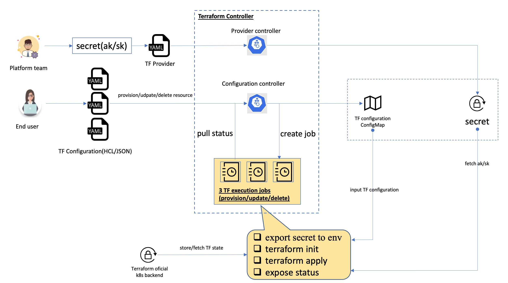

# Terraform Controller

Terraform Controller is a Kubernetes Controller for Terraform, which can address the requirement of [Using Terraform HCL as IaC module in KubeVela](https://github.com/oam-dev/kubevela/issues/698)

# Features

## Supported Cloud Providers

- Alibaba Cloud
- AWS
- GCP

## Supported Terraform Configuration

- HCL
- JSON

# Design

Please refer to [Design](./DESIGN.md).

# Get started

See our [Getting Started](./getting-started.md) guide please.
