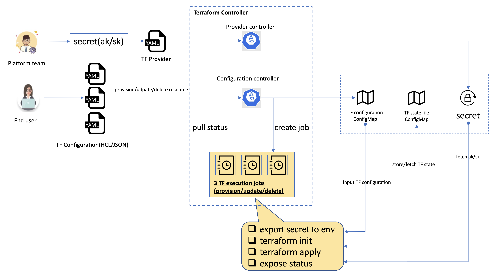

# Terraform Controller

Terraform Controller is a Kubernetes Controller for Terraform.

# Features

## Supported Cloud Providers

- [Alibaba Cloud](https://www.alibabacloud.com/)
- [AWS](https://aws.amazon.com/)
- [Azure](https://portal.azure.com/)
- [Elastic Cloud](https://www.elastic.co/)  by @mattkirby
- [GCP](https://cloud.google.com/)
- [VMware vSphere](https://www.vmware.com/hk/products/vsphere.html)  by @just-do1
- [UCloud](https://www.ucloud.cn/)  by @wangwang
- [Custom cloud provider](https://github.com/oam-dev/terraform-controller/blob/master/examples/custom/configuration_hcl_example.yaml)  by @evanli18

## Supported Terraform Configuration

- HCL
- JSON (Deprecated in v0.3.1)

# Get started

See our [Getting Started](./getting-started.md) guide please.

# Design

Please refer to [Design](./DESIGN.md).

# Contributing

This is the [contributing guide](./CONTRIBUTING.md). Looking forward to your contribution.
