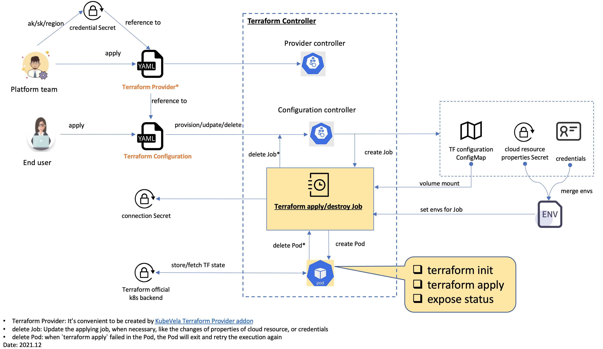

# Terraform Controller

Terraform Controller is a Kubernetes Controller for Terraform.

# Features

## Supported Cloud Providers

| Cloud Provider                                                                                                       | Contributor                                        |
|----------------------------------------------------------------------------------------------------------------------|----------------------------------------------------|
| [Alibaba Cloud](https://www.alibabacloud.com/)                                                                       | KubeVela team                                      |
| [AWS](https://aws.amazon.com/)                                                                                       | KubeVela team                                      |
| [Azure](https://portal.azure.com/)                                                                                   | KubeVela team                                      |
| [Elastic Cloud](https://www.elastic.co/)                                                                             | [@mattkirby](https://github.com/mattkirby)         |
| [GCP](https://cloud.google.com/)                                                                                     | [@emanuelr93](https://github.com/emanuelr93)       |
| [VMware vSphere](https://www.vmware.com/hk/products/vsphere.html)                                                    | [@just-do1](https://github.com/just-do1)           |
| [UCloud](https://www.ucloud.cn/)                                                                                     | [@wangwang](https://github.com/wangwang)           |
| [Custom](https://github.com/oam-dev/terraform-controller/blob/master/examples/custom/configuration_hcl_example.yaml) | [@evanli18](https://github.com/evanli18)           |
| [Tencent Cloud](https://cloud.tencent.com/)                                                                          | [@captainroy-hy](https://github.com/captainroy-hy) |
| [Baidu Cloud](https://cloud.baidu.com/)                                                                              | KubeVela team                                      |

## Supported Terraform Configuration

- HCL
- JSON (Deprecated in v0.3.1, removed in v0.4.6)

# Get started

See our [Getting Started](./getting-started.md) guide please.

# Design

Please refer to [Design](./DESIGN.md).

# Contributing

This is the [contributing guide](./CONTRIBUTING.md). Looking forward to your contribution.
